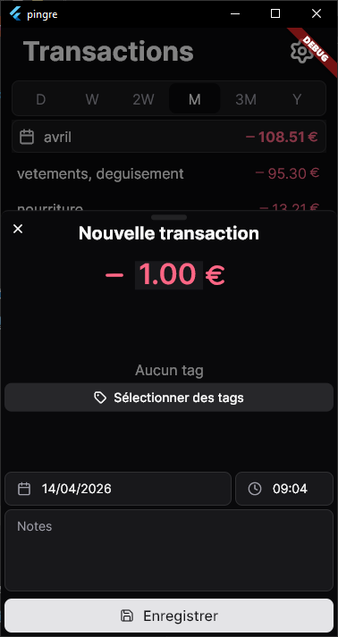
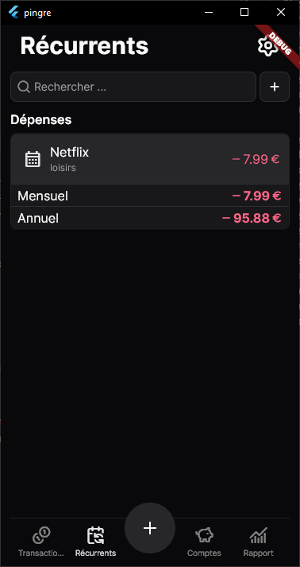
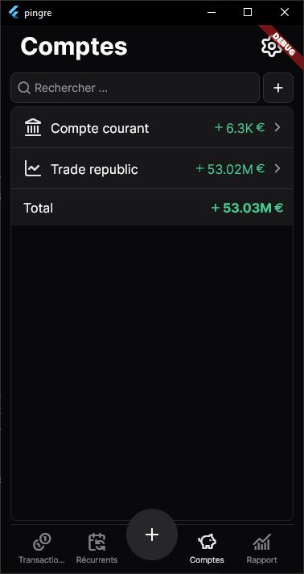
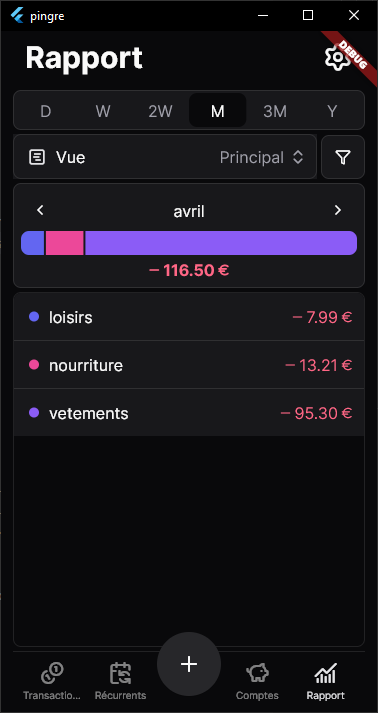

# Pingre

A personal finance management app built with **Flutter**, targeting Android, iOS, Web, and Desktop.

<p align="middle">




</p>

## Features

- **Transactions** — log income and expenses, browse history grouped by time period (day/week/month/year), pull-to-load older entries
- **Recurring** — define scheduled transactions (daily/weekly/monthly/yearly) that are automatically applied on startup
- **Accounts** — manage multiple financial accounts with custom types and colors
- **Reports** — visualize spending by tag with a bar graph, period navigation, and comparison to previous period averages
- **Tags** — categorize transactions with hierarchical tags (primary + secondary); each tag has a name and color

## Tech Stack

| | |
|---|---|
| Framework | Flutter (Dart ≥ 3.10) |
| UI library | [forui](https://pub.dev/packages/forui) |
| State | `provider` (ChangeNotifier) |
| Database | Drift (SQLite) |
| Currency | `decimal` (no float rounding) |
| i18n | Flutter ARB (English + French) |

## Architecture

Feature-first folder structure under `lib/features/`. Each feature owns its models, services, screens, and widgets. Services extend `ChangeNotifier` and are provided at the root via `MultiProvider`.

```
lib/
├── features/
│   ├── transactions/
│   ├── recurring/
│   ├── accounts/
│   ├── reports/
│   ├── tags/
│   └── settings/
└── common/         # Shared models, widgets, utilities
```

Navigation is a 5-tab bottom bar with a floating **+** button to quickly add a transaction.
